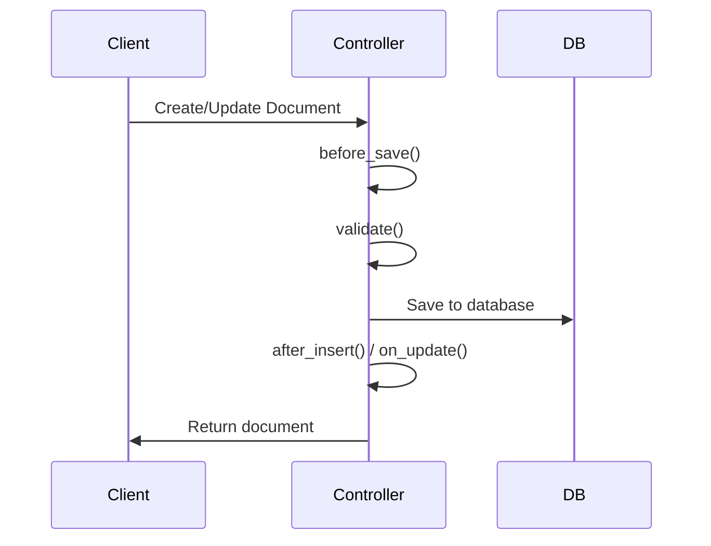
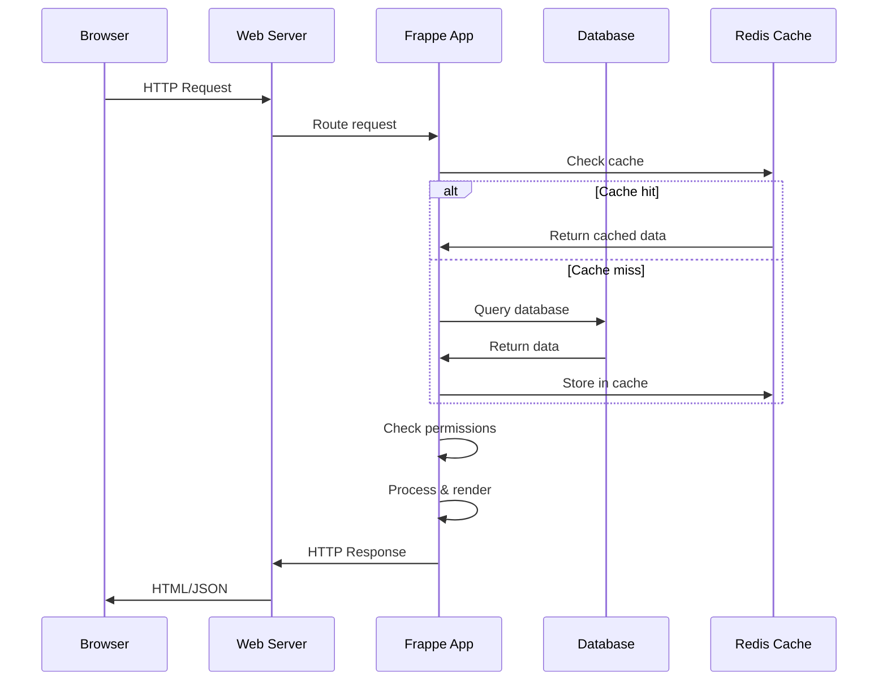

Frappe Framework is a full-stack web framework built on a metadata-driven architecture. This guide explains the core architectural components and how they work together.

## High-level overview

<div style={{textAlign: 'center', margin: '2rem 0'}}>
  ```mermaid
  graph TB
    Client[Client Browser] --> Web[Web Server<br/>Werkzeug]
    Web --> App[Frappe Application<br/>Python]
    App --> DB[(Database<br/>MariaDB)]
    App --> Redis[(Redis<br/>Cache & Queue)]
    App --> Worker[Background Workers<br/>RQ]
    Web --> Socket[SocketIO Server<br/>Real-time]
    Socket --> Redis
  ```
</div>

## Core components

### 1. Metadata-driven architecture

At the heart of Frappe is its metadata system. Instead of writing repetitive code for forms, APIs, and database schemas, you define **what** your data looks like, and Frappe generates the **how**.

```python
# Define once in JSON or UI
{
  "doctype": "Article",
  "fields": [
    {"fieldname": "title", "fieldtype": "Data"},
    {"fieldname": "author", "fieldtype": "Link", "options": "User"},
    {"fieldname": "content", "fieldtype": "Text Editor"}
  ]
}
```

Frappe automatically generates:
- Database table schema
- REST API endpoints
- Admin UI forms and list views  
- JavaScript form controllers
- Permission checks
- Validation logic

<Note>
  This is the "best code is no code" philosophy in action. You get full CRUD applications with minimal custom code.
</Note>

### 2. DocType system

**DocTypes** are Frappe's metadata models that describe business objects.

<AccordionGroup>
  <Accordion title="What is a DocType?">
    A DocType is a model definition that contains:
    - Field definitions (name, type, options)
    - Naming rules
    - Permission rules
    - Behavior flags (is_submittable, is_child, etc.)
    - Hooks for custom logic
    
    Think of DocTypes as your database tables + API + UI + validation, all defined in one place.
  </Accordion>
  
  <Accordion title="DocType types">
    - **Standard**: Regular documents (e.g., Sales Order, User)
    - **Child**: Nested in parent documents (e.g., Order Item)
    - **Single**: Only one instance exists (e.g., Settings)
    - **Virtual**: No database storage, computed on-the-fly
  </Accordion>
  
  <Accordion title="Field types">
    Frappe provides 40+ field types:
    - Basic: Data, Int, Float, Currency
    - Text: Text, Long Text, Text Editor
    - Relations: Link, Table
    - Special: Attach, Image, Signature, Barcode
    - And many more...
  </Accordion>
</AccordionGroup>

### 3. Document lifecycle

Documents (instances of DocTypes) flow through a predictable lifecycle:



**Key lifecycle hooks:**

```python
from frappe.model.document import Document

class Article(Document):
    def before_insert(self):
        # Runs before creating new document
        pass
    
    def before_save(self):
        # Runs before every save (create or update)
        pass
    
    def validate(self):
        # Validate data, throw errors if invalid
        if not self.title:
            frappe.throw("Title is required")
    
    def after_insert(self):
        # Runs after creating new document
        pass
    
    def on_update(self):
        # Runs after updating existing document
        pass
    
    def on_trash(self):
        # Runs before deleting document
        pass
    
    def after_delete(self):
        # Runs after deleting document
        pass
```

<Tip>
  Use `validate()` for throwing errors and `before_save()` for transformations. Frappe automatically handles transactions and rollbacks.
</Tip>

### 4. Database layer

Frappe abstracts database operations through multiple interfaces:

<CodeGroup>
```python ORM methods
# High-level ORM
doc = frappe.get_doc("Article", "article-001")
doc.title = "Updated Title"
doc.save()

# Batch operations
articles = frappe.get_all(
    "Article",
    filters={"status": "Published"},
    fields=["name", "title", "author"]
)
```

```python Query Builder
# Type-safe query builder (PyPika)
Article = frappe.qb.DocType("Article")
Author = frappe.qb.DocType("User")

query = (
    frappe.qb.from_(Article)
    .left_join(Author).on(Article.author == Author.name)
    .select(
        Article.name,
        Article.title,
        Author.full_name.as_("author_name")
    )
    .where(Article.status == "Published")
    .orderby(Article.creation, order=frappe.qb.desc)
)

results = query.run(as_dict=True)
```

```python Direct SQL
# Raw SQL when needed
results = frappe.db.sql("""
    SELECT a.name, a.title, u.full_name
    FROM `tabArticle` a
    LEFT JOIN `tabUser` u ON a.author = u.name
    WHERE a.status = %(status)s
""", {"status": "Published"}, as_dict=True)
```
</CodeGroup>

<Warning>
  Always use parameterized queries or the ORM to prevent SQL injection. Never concatenate user input into SQL strings.
</Warning>

### 5. Multi-tenancy (Sites)

Frappe is multi-tenant by design. Each **site** is an isolated instance with:
- Its own database
- Separate file storage
- Independent configuration
- Different installed apps

```bash
# Create multiple sites on one bench
bench new-site site1.local
bench new-site site2.local
bench new-site customer.example.com
```

At runtime, Frappe determines the site from the HTTP Host header and loads the appropriate context.

### 6. Application structure

Frappe apps follow a conventional structure:

```
library_management/              # App root
├── library_management/          # Python package
│   ├── __init__.py
│   ├── hooks.py                 # App configuration & hooks
│   ├── library_management/      # Module
│   │   └── doctype/             # DocTypes in this module
│   │       └── article/         # Article DocType
│   │           ├── article.py   # Python controller
│   │           ├── article.js   # Client script
│   │           ├── article.json # DocType definition
│   │           └── test_article.py
│   ├── api.py                   # Whitelisted API methods
│   ├── public/                  # Static assets
│   │   ├── css/
│   │   └── js/
│   └── templates/               # Jinja templates
├── requirements.txt
└── setup.py
```

### 7. Hooks system

Hooks are Frappe's extension mechanism. Define hooks in `hooks.py` to inject custom behavior:

```python
# hooks.py
app_name = "library_management"

# Execute code on specific events
doc_events = {
    "Article": {
        "after_insert": "library_management.api.notify_new_article",
        "on_trash": "library_management.api.cleanup_article"
    },
    "*": {  # All DocTypes
        "validate": "library_management.api.global_validation"
    }
}

# Add custom permissions
permission_query_conditions = {
    "Article": "library_management.api.article_query_permissions"
}

# Override standard methods
override_whitelisted_methods = {
    "frappe.desk.search.search_link": "library_management.api.custom_search"
}

# Scheduled jobs
scheduler_events = {
    "daily": [
        "library_management.tasks.send_overdue_reminders"
    ],
    "hourly": [
        "library_management.tasks.sync_inventory"
    ]
}
```

See the [hooks reference](/concepts/hooks) for all available hooks.

### 8. Permission system

Frappe has a sophisticated role-based permission system:

<Steps>
  <Step title="Roles">
    Users are assigned roles (e.g., "Librarian", "Library Member")
  </Step>
  
  <Step title="DocType permissions">
    Define what each role can do with a DocType (read, write, create, delete, submit, etc.)
  </Step>
  
  <Step title="User permissions">
    Restrict access to specific documents (e.g., a user can only see their own articles)
  </Step>
  
  <Step title="Custom permission queries">
    Write Python code for complex permission logic:
    
    ```python
    def get_permission_query_conditions(user):
        if "Librarian" in frappe.get_roles(user):
            return None  # Can see all
        return f"""(`tabArticle`.owner = {frappe.db.escape(user)})"""
    ```
  </Step>
</Steps>

### 9. REST API layer

Frappe automatically exposes REST APIs for all DocTypes:

| Method | Endpoint | Action |
|--------|----------|--------|
| GET | `/api/resource/:doctype` | List documents |
| GET | `/api/resource/:doctype/:name` | Get document |
| POST | `/api/resource/:doctype` | Create document |
| PUT | `/api/resource/:doctype/:name` | Update document |
| DELETE | `/api/resource/:doctype/:name` | Delete document |

You can also create custom endpoints:

```python
@frappe.whitelist()
def get_available_books():
    return frappe.get_all(
        "Article",
        filters={"status": "Available"},
        fields=["name", "title"]
    )

# Access at: /api/method/library_management.api.get_available_books
```

### 10. Real-time communication

Frappe includes SocketIO for real-time features:

```python
import frappe

# Server-side: publish event
frappe.publish_realtime(
    event="new_article",
    message={"title": "New Book Available"},
    user="user@example.com"  # Optional: specific user
)
```

```javascript
// Client-side: listen for events
frappe.realtime.on("new_article", (data) => {
    console.log("New article:", data.title);
    frappe.show_alert({
        message: data.title,
        indicator: "green"
    });
});
```

### 11. Background jobs

Long-running tasks run in background workers using RQ (Redis Queue):

```python
from frappe.utils.background_jobs import enqueue

def generate_report(filters):
    # Long-running task
    pass

# Queue the job
enqueue(
    generate_report,
    queue="long",           # short, default, or long
    timeout=3600,           # Max execution time
    filters={"year": 2024}
)
```

### 12. Request-response flow

Here's what happens when a request hits Frappe:



## Framework components in detail

### frappe.local

Thread-local storage for request context:

```python
import frappe

# Access current user
print(frappe.local.session.user)

# Access current site
print(frappe.local.site)

# Access request
print(frappe.local.request.method)
print(frappe.local.form_dict)  # Request params
```

### frappe.db

Database interface:

```python
# Get values
value = frappe.db.get_value("Article", "article-001", "title")

# Set values (bypasses ORM)
frappe.db.set_value("Article", "article-001", "status", "Published")

# Check existence
if frappe.db.exists("Article", "article-001"):
    pass

# Transaction control
frappe.db.commit()
frappe.db.rollback()
```

### frappe.cache

Redis-backed cache:

```python
# Set cache
frappe.cache.set_value("my_key", {"data": "value"}, expires_in_sec=300)

# Get cache
data = frappe.cache.get_value("my_key")

# Delete cache
frappe.cache.delete_value("my_key")
```

## Design principles

<CardGroup cols={2}>
  <Card title="Convention over configuration" icon="book-open">
    Follow Frappe's conventions, and things work automatically
  </Card>
  <Card title="Metadata-driven" icon="database">
    Define data structures once, get UI, API, and storage
  </Card>
  <Card title="Modular apps" icon="puzzle-piece">
    Build reusable apps that can be installed on any site
  </Card>
  <Card title="Multi-tenant by default" icon="users">
    Every deployment can host multiple isolated sites
  </Card>
</CardGroup>

## Performance considerations

<AccordionGroup>
  <Accordion title="Caching">
    - Redis caches DocType metadata, user permissions, and custom data
    - Use `@frappe.whitelist(allow_guest=True)` for public pages
    - Implement page caching for public websites
  </Accordion>
  
  <Accordion title="Database optimization">
    - Add indexes for frequently queried fields
    - Use `frappe.get_all()` instead of loading full documents
    - Batch operations when possible
    - Use Query Builder for complex queries
  </Accordion>
  
  <Accordion title="Background jobs">
    - Move heavy processing to background workers
    - Use appropriate queue (short/default/long)
    - Implement progress tracking with `publish_progress()`
  </Accordion>
</AccordionGroup>

## Next steps

<CardGroup cols={2}>
  <Card title="DocType guide" icon="book" href="/concepts/doctype">
    Deep dive into DocTypes and field types
  </Card>
  <Card title="Python API reference" icon="code" href="/api/document">
    Explore the full Python API
  </Card>
  <Card title="Building apps" icon="hammer" href="/apps/creating-app">
    Build production-ready applications
  </Card>
  <Card title="Deployment" icon="server" href="/deployment/production">
    Deploy Frappe to production
  </Card>
</CardGroup>

<Tip>
  **Learn by example:** The Frappe Framework itself is a Frappe app! Explore the [source code on GitHub](https://github.com/frappe/frappe/tree/develop/frappe) to see these patterns in action.
</Tip>
